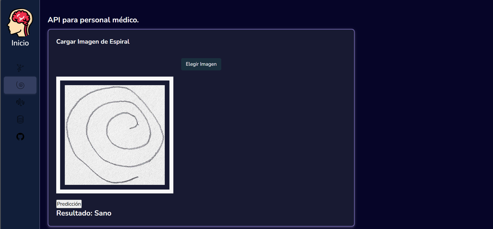

# **Interfaz de Predicción para Micrografía en Parkinson**

Este repositorio contiene la implementación final de la interfaz desarrollada como parte de un proyecto de investigación sobre la **micrografía en la Enfermedad de Parkinson**. La herramienta está construida con **Flask** para el backend y **CSS** para el diseño de la interfaz, permitiendo la carga y uso de modelos de predicción previamente entrenados y preprocesados.

---

## **Características principales**

- **Modelos de predicción compatibles:**
  - Redes Neuronales Densas (DNN)
  - Redes Neuronales Convolucionales (CNN)
  - Random Forest

- **Flujo de trabajo:**
  1. Seleccionar una opción en el menú lateral izquierdo:
     - **Opción 1:** Redes neuronales.
     - **Opción 2:** Predicción de ondas con Random Forest.
     - **Opción 3:** Predicción de espirales con Random Forest.
     - **Opción 4:** Redirección a la base de datos o al repositorio del proyecto.
  2. Cargar una imagen de espiral o onda.
  3. Hacer clic en el botón de **Predicción** para obtener resultados.

---

## **Tecnologías utilizadas**

- **Backend:** Flask
- **Frontend:** CSS
- **Machine Learning:** Modelos preentrenados en Python

---

## **Requisitos del sistema**

Antes de ejecutar el proyecto, asegúrate de tener instalados los siguientes componentes:

- Python 3.7 o superior
- Flask (`pip install flask`)
- Librerías para Machine Learning (TensorFlow, scikit-learn, etc.)

---

## **Cómo usar este repositorio**

1. **Clona el repositorio:**
   ```bash
   git clone https://github.com/tu-usuario/nombre-del-repo.git
   

